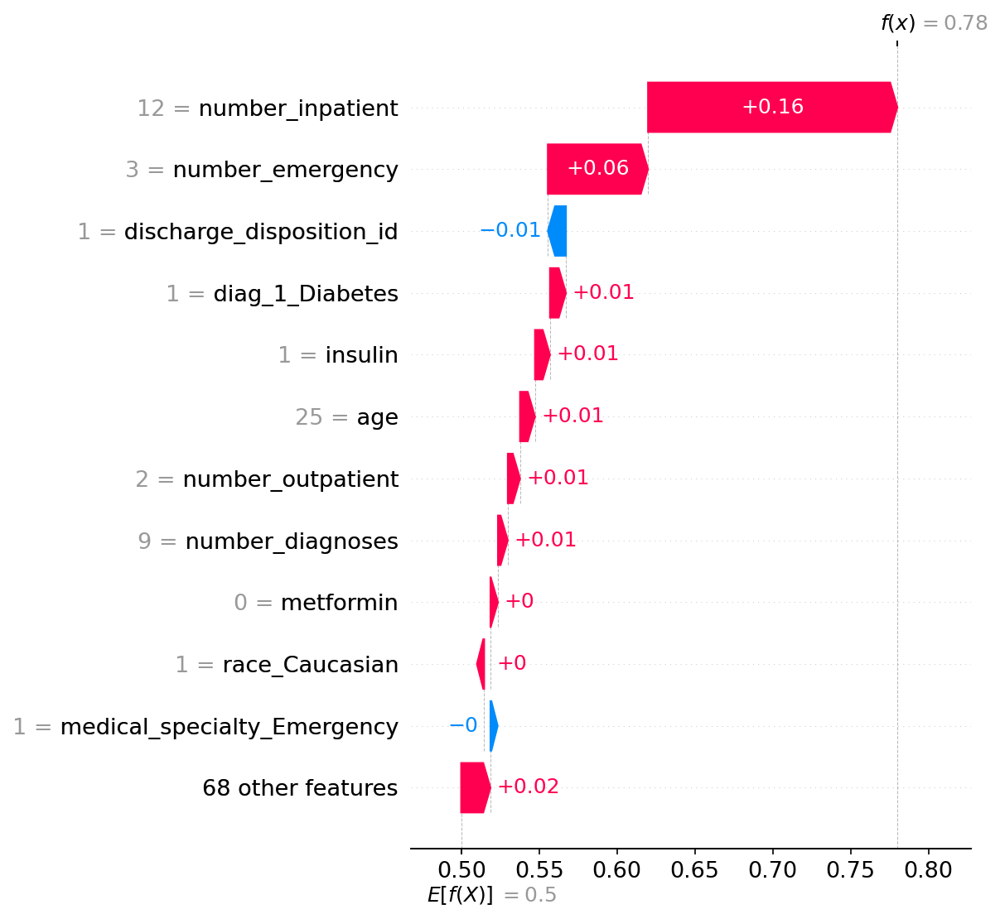
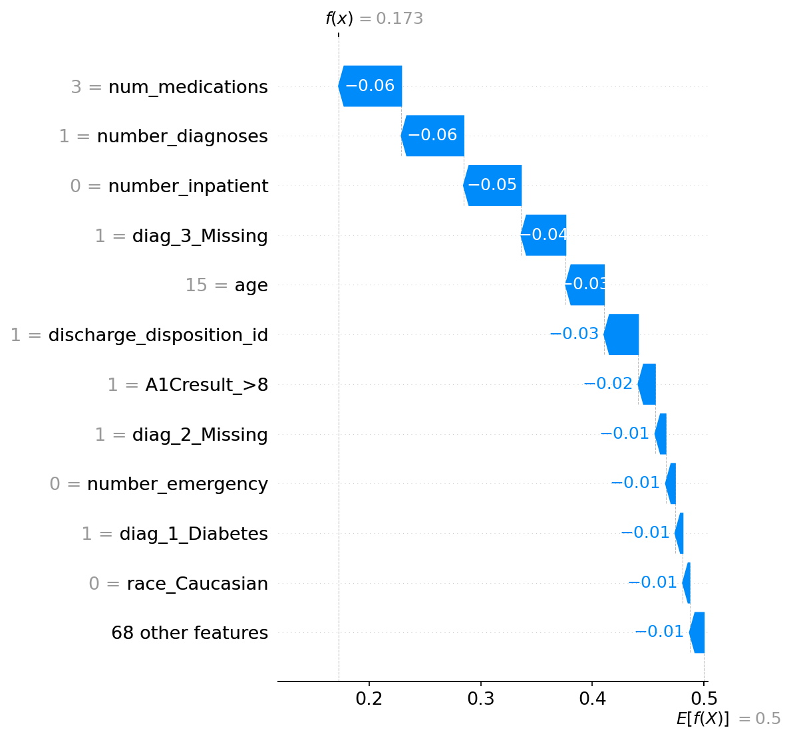
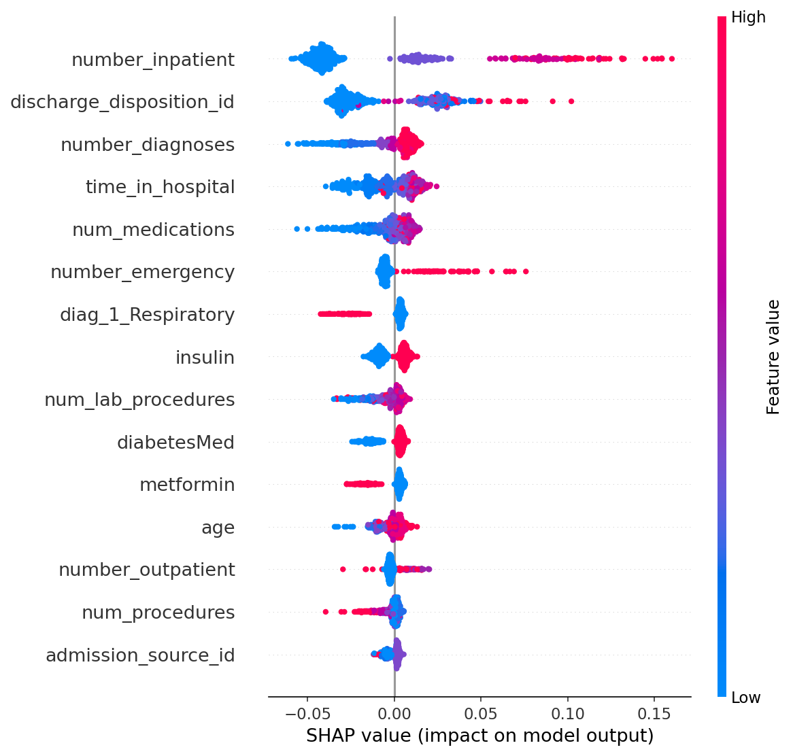

# Hospital Readmission Risk

A machine learning project that predicts whether a diabetic patient will be readmitted to the hospital within 30 days of discharge.

Built as a portfolio project combining clinical domain knowledge with data engineering and ML — using a real dataset of 101,766 patient encounters from 130 US hospitals.

---

## The Problem

30-day hospital readmissions cost the US healthcare system billions of dollars annually and often signal that a patient didn't receive adequate follow-up care after discharge. Identifying high-risk patients before they leave the hospital gives care teams a window to intervene.

This project builds a model that flags those patients using data available at the time of discharge — prior visit history, medications, diagnoses, length of stay, and more.

---

## Results

| Metric | Value |
|---|---|
| ROC-AUC | 0.670 |
| Recall (readmitted class) | 0.49 |
| Precision (readmitted class) | 0.20 |
| Accuracy | 0.72 |

The model catches **49% of actual 30-day readmissions** — compared to 0% with a naive baseline that predicts no one gets readmitted. In a clinical setting, higher recall is prioritized over precision: a false positive means an extra follow-up call; a false negative means a high-risk patient gets no intervention.

---

## Key Finding

**Prior inpatient visits** is by far the strongest predictor of 30-day readmission — patients with more prior hospitalizations are significantly more likely to return within 30 days. This aligns with the clinical concept of "frequent flyers" — complex patients with unstable conditions and high healthcare utilization.

---

## SHAP Explanations

The model uses SHAP (SHapley Additive exPlanations) to explain individual predictions — not just a risk score, but the specific reasons behind it.

**High-risk patient (78% predicted probability):**


This patient has 12 prior inpatient visits and 3 emergency visits. Those two features alone push their predicted risk from the 50% baseline to 78%.

**Low-risk patient (17% predicted probability):**


This patient has no prior hospitalizations, only 1 diagnosis, and 3 medications. Every feature pushes their risk down.

---

## Global Feature Importance



Red dots = high feature values, blue dots = low feature values. The x-axis shows how much each feature pushes the prediction toward or away from readmission.

---

## Dataset

**Diabetes 130-US Hospitals (1999-2008)**
- Source: [UCI Machine Learning Repository](https://archive.ics.uci.edu/ml/datasets/Diabetes+130-US+hospitals+for+years+1999-2008)
- 101,766 patient encounters across 130 US hospitals
- 50 features including demographics, diagnoses, medications, and utilization history
- Target: readmitted within 30 days (11.2% positive rate)

---

## Project Structure
```
hospital-readmission-risk/
├── data/
│   ├── diabetic_data.csv          # raw dataset (not tracked in git)
│   └── diabetic_data_clean.csv    # preprocessed (not tracked in git)
├── models/
│   └── random_forest_model.pkl
├── notebooks/
│   ├── 02_exploratory_analysis.ipynb
│   └── 03_preprocessing.ipynb
├── reports/
│   ├── 01_class_imbalance.png
│   ├── 02_age_readmission.png
│   ├── 03_clinical_factors.png
│   ├── 04_top_diagnoses.png
│   ├── 05_age_encoded.png
│   ├── 06_shap_summary.png
│   ├── 07_shap_patient_high_risk.png
│   └── 08_shap_patient_low_risk.png
├── src/
│   ├── load_data.py
│   ├── preprocess.py
│   ├── train_model.py
│   ├── explain_model.py
│   └── diagnose_model.py
└── README.md
```

---

## Setup

```bash
# Clone the repo
git clone https://github.com/matthewcarballo/hospital-readmission-risk.git
cd hospital-readmission-risk

# Create and activate the conda environment
conda create -n readmission python=3.13 -y
conda activate readmission

# Install dependencies
pip install pandas numpy matplotlib seaborn scikit-learn jupyter ipykernel shap imbalanced-learn python-dotenv

# Download the dataset from UCI (link above) and place diabetic_data.csv in data/

# Run the pipeline
python src/load_data.py
python src/preprocess.py
python src/train_model.py
python src/explain_model.py
```

---

## Tools

Python 3.13 · pandas · scikit-learn · SHAP · matplotlib · seaborn · Jupyter · Git · GitHub

---

## Author

Matthew Carballo — [GitHub](https://github.com/matthewcarballo)